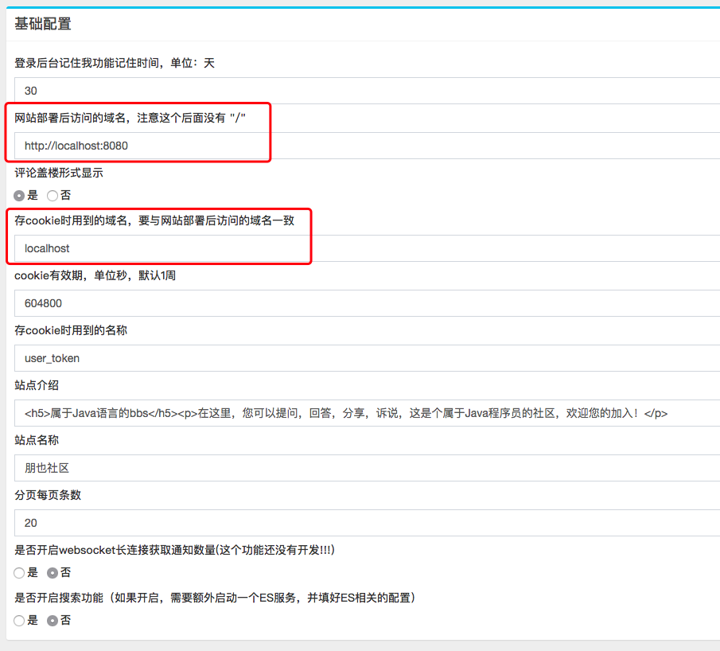

The only configuration that needs to be configured is the database-related configuration 
(if your database username is root and the password is empty, the database is on the same machine as the program, 
then no configuration is required)

Configure the database connection to find the configuration file to modify the following configuration

- `src/main/resources/application-dev.yml` Development startup configuration file
- `src/main/resources/application-prod.yml` Configuration file at deployment
- `src/main/resources/application-docker.yml` Configuration file when booted by docker

```yml
datasource_driver: com.mysql.cj.jdbc.Driver
datasource_url: jdbc:mysql://localhost:3306/pybbs?useSSL=false&characterEncoding=utf8
datasource_username: root
datasource_password:
```

Other configuration，Launcher -> Access backend address -> 系统设置  As shown


There are several places that must be modified, as shown in the red box below.



Description:

1. If the domain name of the website is `http://example.com` then the domain name accessed after the website is deployed, 
    note that there is no "/" after this. The content under this description should be replaced with `http://example.com`
2. After configuring the domain name in the first step, the domain name setting of the cookie should be modified accordingly. 
    Otherwise, the user login record cannot be saved. The domain name used in the storage of the cookie must be 
    the same as the domain name accessed after the website is deployed. Replace `localhost` with `example.com` by following the instructions.
3. In addition to the above two must be modified, the upload path of the website must be configured in advance, see [上传配置](upload)

Other configurations can be modified according to their own environment.
