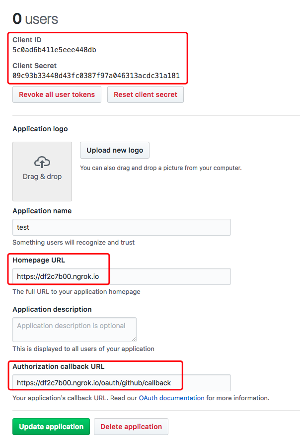

A github login function is implemented in the project.

apply `clientId`, `clientSecret` address: https://github.com/settings/developers

After opening the page, click the `New OAuth APP` button

Fill in the necessary information

After filling in, save, jump page has clientId, clientSecret information, as shown below

Copy the red box in the figure above and paste it into the Github configuration information in the backend system settings page of the website.

**note**

- The domain name of the website must be accessible to the public network. If you want to test on the internal network, 
    you can use ngrok, frp and other tools to do intranet penetration.
- The callback address format is the website domain name + /oauth/github/callback. If your domain name is `http://example.com` 
    then the callback address here is `http://example.com/oauth/github/callback` 

After configuration, save, go back to the home page, you can see the entry of `Github login` on the page header.

