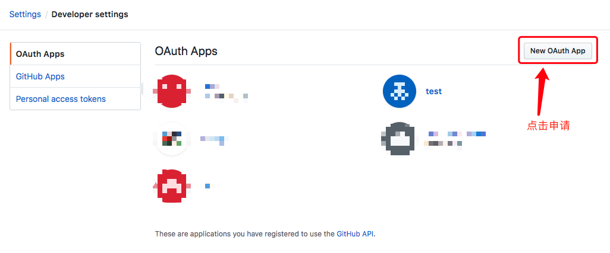

项目里实现了一个github登录功能，又实现了一个微信登录的功能

### Github登录配置方法

申请clientId, clientSecret地址：https://github.com/settings/developers 前提要先登录github

打开页面后，点击 `New OAuth APP` 按钮

填上必要的信息

填写好之后，保存，跳转的页面上就有 clientId, clientSecret信息了，如下图

拷贝上图中红框内容，粘贴到网站后台系统设置页面里的 Github 配置信息里

刷新登录页面即可出现相应按钮

**注意**

- 网站域名必须外网能访问，如是你要在内网测试，可以使用ngrok，frp等工具来做内网穿透，具体使用方法百度吧，网上很多
- 回调地址格式是 网站域名+/oauth/github/callback 假如你的域名是 `http://example.com` 那么这里的回调地址就是 `http://example.com/oauth/github/callback` 不要填错了

配置好之后，保存，再次回到首页，就可以看到页面 header 上就有了`Github登录`的入口了

### 微信登录配置方法

注册开放平台 http://open.weixin.qq.com 然后创建web应用，跟着步骤一步一步来就可以了，最后可以拿到 `appid` `appsecret` 加上在创建应用的时候填上的 `callback`

总共三个参数，都配置在`朋也社区`后台设置页面里`微信登录`区域，然后刷新登录页面，就有微信登录按钮了！！

**感谢 [@gdhua](https://github.com/gdhua) 提供的微信联合登录要用到的 `appid` `appsecret`**
